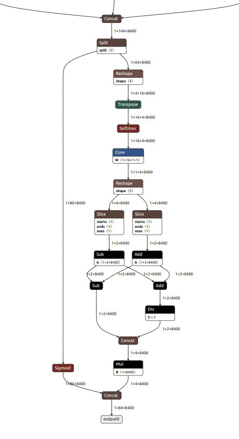

## Static QDQ Quantization
Static QDQ quantization for yolo.
### Installation
Install the dependencies
```bash
python3.10 -m venv calib
source calib/bin/activate
pip install -U pip

pip install -r requirements.txt
```

### Steps for Quantization

Download sample Coco Dataset
```bash

git clone https://github.com/lizhogn/tiny_coco_dataset.git
```

Use the ultralytics package to load and convert the torchscript model to onnx.

```bash
python export.py --model yolov8n.pt
```

Preprocess the onnx model using onnxruntime

```bash
python -m onnxruntime.quantization.preprocess --input yolov8n.onnx --output preprocessed.onnx
```

Static Quantization of preprocessed onnx model

```bash
python qdq_quantization.py --model preprocessed.onnx --model_type yolov8 --out_path static_quantized.onnx --data_path "tiny_coco_dataset/tiny_coco/train2017"
```
*NOTE: For yolov5 change the model loaded and export to yolov5 and the model_type paramter to yolov5 in quatization part.*

*NOTE: The nodes to exclude are those in last subgraph of preprocessed yolo model visualized with netron*

