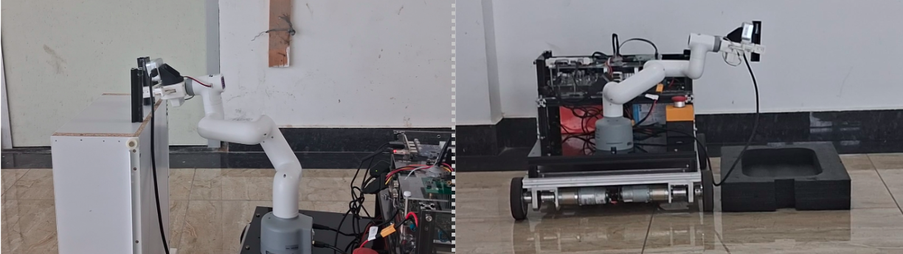

# Mobile Pick and Place

## Project Overview
The **Mobile Pick and Place** project involves a robotic arm mounted on an Autonomous Mobile Robot (AMR). The system performs pick-and-place operations autonomously by navigating to a target location, detecting and estimating the pose of objects using a YOLO-based object detection module, and executing robotic arm movements. The navigation stack and Robotics arm software is implemented using the ROS 2 Humble framework.
 
### System Workflow
1. **Navigation** : The AMR navigates from its current location to the designated pick and drop location using the Nav2 stack.
2. **Object Detection and 3D/6D Pose Estimation( pose_estimation_pkg )**: A YOLO-based AI module identifies the object and uses it for estimating the pose of the object relative to the camera by utilizing Hyco compiler. 
3. **Pose Transformation**: The `rcar_communication` package transforms the pose from the camera frame to the base frame of the robotic arm. 
4. **Pick-and-Place Operation**: Joint angles are calculated, and the robotic arm executes the pick-and-place task.
 
---
## Setup Instructions

## Prerequisites
- ROS 2 [Humble](https://docs.ros.org/en/humble/Installation/Ubuntu-Install-Debs.html) installed on your system.
- Correct hardware connections for the AMR and robotic arm.
- A YOLO v8-based object detection model.

### 1.Clone Repository
```sh
git clone https://github.com/Ignitarium-Renesas/R-Car_Mobile_Pick_Place_V2.git
```
### 2. Install Requirements
```sh
cd R-Car_Mobile_Pick_Place_V2/pick_n_place_ws/
pip install -r src/pose_estimation_pkg/requirements.txt 
pip install pymycobot --upgrade 

cd R-Car_Mobile_Pick_Place_V2/pick_n_place_ws/src/Project-Rover-Robot
npm i 
```
### 3. Build the Workspace
```sh
cd R-Car_Mobile_Pick_Place_V2/pick_n_place_ws
colcon build
```
### 4. Flash the AMR code into Arduino
Flash the code provided in this [folder](./Easy_mech_base_firmware/arduino_code_for_AMR_IMU.ino) in to arduino board. 
***
## Run Application

### Step 1: Verify Connections
Ensure all hardware connections are correctly set up.

- Turn on the Wi-Fi Router.
- Turn on the robotic arm & mobile base.

### Step 2: Connect to MechArm Robotic Arm Controller

Connect to the Wi-Fi access point:
```sh
SSID: IGN-Robo_5G
Pass: IGN_Robo  
```
Log in to the Mecharm using SSH:
```sh
ssh er@192.168.0.146
# Password: Elephant (default password for Elephant Robotics Hardware)
```
### Step 3: Launch the RealSense Camera Node
Open a terminal in the Mecharm and launch the camera node:
```sh
ros2 launch realsense2_camera rs_launch.py
```
### Step 4: Launch the Arm Server Script
Open a terminal in the mecharm and launch the camera node:
```sh
python3 Server_280.py
```
### Step 5: Run Rcar demo launch file
```bash
ssh root@192.168.0.217

docker start rcar
docker exec -it rcar bash
ros2 launch rcar_demo run_demo.launch.py
```
### Step 6: Run HyCo Application (Websocket)
```bash
# copy app_temp in to rcar board
scp -r HyCo_Infer_App/app_temp/ root@192.168.0.217:~/

ssh root@192.168.0.217
cd app_temp
export LD_LIBRARY_PATH=${LD_LIBRARY_PATH}:/lib:/home/root/app_temp/onnxruntime-linux-aarch64-1.17.1/lib:/home/root/app_temp

./rcar_app_ws yolo_v5s_ign-app/exec_config.json
```
### Step 7: Start and enter the Docker container

```bash
ssh root@192.168.0.217 

docker start rcar 

docker exec -it rcar bash 

#run navigation modules:Bringup 

ros2 launch rcar_robot base_bringup.launch.py 
```
### Step 8: Launch Navigation
```bash
ssh root@192.168.0.217 

docker start rcar 

docker exec -it rcar bash 

#run navigation modules:Navigation 

Ros2 launch rcar_robot rcar_navigation.launch.py 
```

### Step 9: Launch GUI & Start Demo
```bash
cd R-Car_Mobile_Pick_Place_V2/pick_n_place_ws/src/mycobot280/Project-Rover-Robot/ 
node index.js 
 
#Open a Browser and in search tab type: 
http://localhost:5000/ 
```
***

### Notes:
- *Refer the [PCB_Files](./PCB_Files/) folder for Design related files*
- *Refer this [README](./pick_n_place_ws/src/pose_estimation_pkg/README.md) for further instruction related to pose estimation.*
- *Refer this [README](./HyCo_Infer_App/README.md) for further instructions related to HyCo Inference.*
- Refer this [README](./pick_n_place_ws/src/rcar_communication/README.md) for further instructions related to Pose Transformation and services.
****