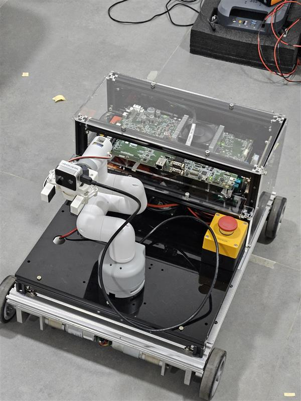

# Easy Mech 4WD Robot with ROS2 Odometry

## Overview
This project implements a **ROS2-based control system for Easy Mech AMR base** for a **4-wheel drive (4WD) robot**, where each wheel is controlled independently. The robot receives velocity commands (`cmd_vel`) and converts them into motor speed signals. Additionally, the robot has **four wheel encoders** to measure wheel movement, which is used to compute **odometry**.

### Main Features
- ✅ **Velocity Control:** Subscribes to `/cmd_vel` (Twist messages) to control motor speeds.
- ✅ **Encoder Data Processing:** Reads wheel encoder ticks via serial communication.
- ✅ **Odometry Calculation:** Computes position `(x, y, theta)`


### Prerequisites
Ensure you have:
- ✅ **ROS2 Humble (or latest version) installed**
- ✅ **Python3 with dependencies:** `rclpy`, `nav_msgs`, `geometry_msgs`
- ✅ **A connected microcontroller** (e.g., Arduino) sending encoder ticks via serial


## How to Run
###  Start ROS2
Open a terminal and source your ROS2 workspace:
```bash
source /opt/ros/humble/setup.bash
source ~/ros2_ws/install/setup.bash  # If using a custom workspace
```

###  Step 1: Run Base Driver Node
This node communicates with the microcontroller/motor controller and publishes encoder + raw IMU data:
```bash
ros2 run rcar_robot base_driver
```

###  Step 2: Launch RPLidar Node
Make sure the correct port is used (e.g., /dev/ttyUSB1):
```bash
ros2 launch rplidar_ros rplidar_a1_launch.py serial_port:=/dev/ttyUSB1
```
###  Launch RCAR Bringup
This launches:\
IMU Complementary Filter node\
Odometry node (rcar_odom)\
Static TF node\
EKF node (from robot_localization)\
Laser Filter node 
```bash
ros2 launch rcar_robot rcar_bringup.launch.py
```
###  Step 4: Launch Navigation Stack
This brings up the full Nav2 stack including:\
Map Server\
Global & Local Costmaps\
Controller, Planner, Recovery nodes\
RViz with preloaded config
```bash
ros2 launch rcar_robot rcar_navigation.launch.py
```

###  Step 5: Use RViz to Send Goal
RViz will launch automatically \
Use “2D Goal Pose” tool to click a destination \
The robot will plan and follow the path to the goal

 
